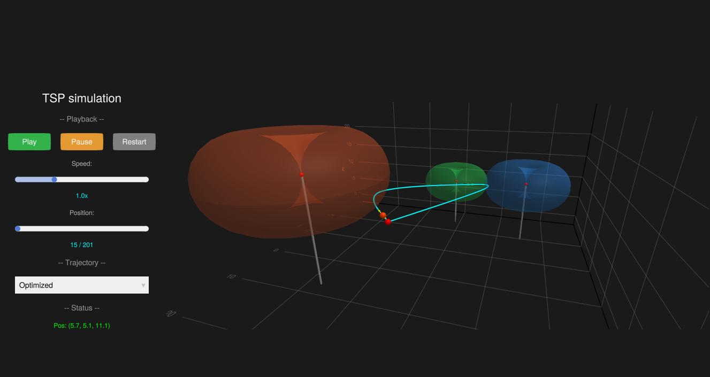

# Project_biloumak
Traveling Salesman Problem with Neighborhoods
The main idea is to extend the standard TSP (travelling salesman problem). In the model, the signal zones from APs (access points) would have toroid shapes.

